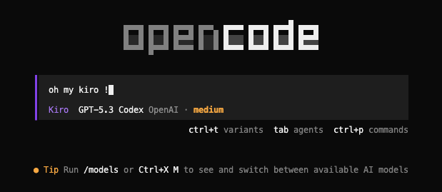

# Kiro Plugin for OpenCode

Kiro is a spec-driven, multi-agent coding plugin for OpenCode.

## Runtime Architecture

### Agents

| Agent | Mode | Purpose |
|---|---|---|
| `kiro` | primary | Main orchestrator |
| `kiroExplore` | subagent | Fast codebase exploration |
| `requirements-first-workflow` | subagent | Build and refine specs |
| `spec-task-execution` | subagent | Execute a spec task |
| `context-gatherer` | subagent | Gather focused code context |
| `general-task-execution` | subagent | General implementation work |
| `multimodal-looker` | subagent | Image/document understanding |


### Tools

| Category | Tool Names |
|---|---|
| Kiro-specific | `prework`, `kiroSpecTaskStatus`, `updatePBTStatus` |
| Background tasks | `backgroundTask`, `backgroundTaskStatus`, `backgroundTaskOutput`, `backgroundTaskCancel`, `listBackgroundTasks` |
| AST-grep | `astGrepSearch`, `astGrepReplace` |
| Multimodal | `lookAt` |
| LSP | `kiroGetDiagnostics`, `kiroRenameSymbol` |

Kiro also relies on OpenCode built-ins such as `read`, `write`, `edit`, `glob`, `grep`, `bash`, and `task`.


## Repository Layout

```text
oh-my-kiro/
├── src/
│   ├── agents/                  # Kiro orchestrator + subagent definitions
│   ├── background/              # Background task manager/runtime
│   ├── clipboard-files-queue/   # Persistent queue for pasted images
│   ├── config/                  # Config types, parsing, loading
│   ├── features/
│   │   └── builtin-commands/    # /spec command wiring
│   ├── hooks/                   # Plugin lifecycle hooks
│   ├── plugin/                  # Plugin type/registry helpers
│   ├── shared/                  # Shared utilities
│   └── tools/
│       ├── ast-grep/            # AST search/replace tools
│       ├── background-tools/    # Background task management tools
│       ├── clipboard-files-queue/ # Clipboard queue tools
│       ├── kiro-specific/       # Kiro-specific tools (prework, status)
│       ├── look-at/             # Multimodal image analysis
│       └── lsp-tools/           # LSP integration (diagnostics, rename)
├── dist/                        # Build output
└── assets/                      # Documentation assets
```

## Installation and Activation

From repository root:

```bash
# 1) Install dependencies
make install-kiro

# 2) Build plugin , get dist/index.js
make build-kiro
```

Manual registration:

Edit ~/.config/opencode/opencode.jsonc

```jsonc
{
  "plugin": ["file:///absolute/path/to/plugins/kiro/dist/index.js"]
}
```

## Configuration

Kiro reads config from one file only:
- `~/.config/opencode/kiro/kiro.json`

Currently supported config keys:

| Key | Type | Default | Description |
|---|---|---|---|
| `lookAt.enable` | boolean | `false` | Enable/disable the `lookAt` multimodal tool |
| `lookAt.model` | string | - | Multimodal-capable model name (`provider/model`) used by `lookAt`. Required if `lookAt.enable` is `true`. Must be a model with vision capabilities (e.g., `openai/gpt-5.3-codex`). |

Example (`kiro.example.json`):

```json
{
  "lookAt": {
    "enable": true,
    "model": "openai/gpt-5.3-codex"
  }
}
```

## Clipboard Files Queue

Kiro automatically saves pasted images to a persistent queue, enabling image analysis even when using non-vision coding models.

When `lookAt.enable` is `true`, the coding agent can analyze pasted images:

```
User: [pastes screenshot]
User: What's in this image?

Agent: [calls lookAt with index=-1 to analyze the most recent pasted image]
```

## `/spec` Command

> **Note:** This command is primarily used to trigger the agent to follow the spec workflow. Kiro generally operates in spec-driven mode by default, so `/spec` is not mandatory, it serves as an optional reminder/helper.

Built-in command:
- `/spec`

Common usage:

| Command | Behavior |
|---|---|
| `/spec` | Discover existing specs and suggest next action |
| `/spec <feature>` | Open/create that feature spec |
| `/spec <feature> <task>` | Execute one task from `tasks.md` |
| `/spec <feature> run-all` | Execute all tasks sequentially |
| `/spec <feature> status` | Show status for one spec |
| `/spec status` | Infer and show current spec status |

Spec files live under `.kiro/specs/<feature>/`:
- `requirements.md`
- `design.md`
- `tasks.md`

## Acknowledgments

- [Kiro](https://kiro.dev/)
- [oh-my-opencode](https://github.com/code-yeongyu/oh-my-opencode)
- [OpenCode](https://github.com/anomalyco/opencode)
