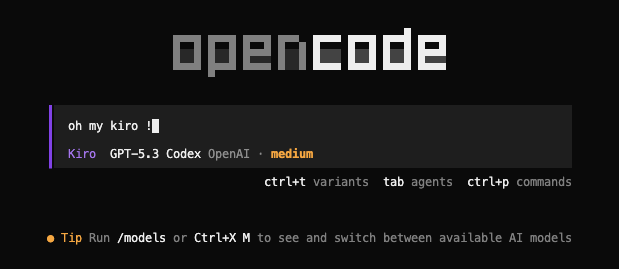

# Oh My Kiro Plugin for OpenCode

Oh My Kiro is a spec-driven, multi-agent coding plugin for [OpenCode](https://github.com/opencode-ai/opencode).

> Kiro is great, Spec-Driven Development works, but the subscription credits are too limited, and the context window is too small for serious use. So I reverse-engineered Kiro and built oh-my-kiro — an open-source alternative with the same capabilities and better UX, no more worrying about context limits, and full freedom to configure the underlying model.

## Features

- **Spec-Driven Development**: Enforces **Requirements → Design → Tasks → Implementation** workflow
- **Dynamic Task Graph**: Supports branching, loops, and parallel execution in task workflows
- **Multi-Agent Architecture**: Specialized subagents for different tasks (exploration, execution, analysis)
- **Background Tasks**: Run subagents in parallel without blocking the main conversation
- **AST-based Search**: Structural code search and refactoring using ast-grep
- **Code Execution**: Stateful JavaScript execution in Jupyter kernels for browser automation and workflows
- **Browser Automation**: Built-in support for Stagehand and browser-use skills
- **Multimodal Support**: Image and document analysis via configurable vision models
- **LSP Integration**: Get diagnostics and rename symbols using Language Server Protocol

## Agents

| Agent                         | Mode     | Purpose                                                |
| ----------------------------- | -------- | ------------------------------------------------------ |
| `kiro` (orchestrator)         | primary  | Main orchestrator that coordinates all subagents       |
| `requirements-first-workflow` | subagent | Build and refine specs (requirements → design → tasks) |
| `spec-task-execution`         | subagent | Execute a single task from a spec's tasks.md           |
| `kiroExplore`                 | subagent | Deep codebase exploration                              |
| `context-gatherer`            | subagent | Gather focused code context                            |
| `general-task-execution`      | subagent | General implementation work                            |
| `multimodal-looker`           | subagent | Image/document understanding                           |

## Tools

| Category             | Tools                                                                                                                                                     | Description                            |
| -------------------- | --------------------------------------------------------------------------------------------------------------------------------------------------------- | -------------------------------------- |
| **Kiro-specific**    | `prework`, `kiroSpecTaskStatus`, `updatePBTStatus`                                                                                                        | Spec workflow management               |
| **Background tasks** | `backgroundTask`, `backgroundTaskStatus`, `getTaskOutput`, `backgroundTaskCancel`, `listBackgroundTasks`, `waitForBackgroundTasks`, `listAllTaskSessions` | Parallel subagent execution            |
| **AST-grep**         | `astGrepSearch`, `astGrepReplace`                                                                                                                         | Structural code search and refactoring |
| **Code execution**   | `execute_code`, `list_code_sessions`, `close_code_session`                                                                                                | Stateful JavaScript in Jupyter kernels |
| **Multimodal**       | `lookAt`                                                                                                                                                  | Image/PDF analysis (optional)          |
| **LSP**              | `kiroGetDiagnostics`, `kiroRenameSymbol`                                                                                                                  | Language Server integration            |
| **Clipboard**        | `listClipboardFiles`                                                                                                                                      | Access pasted images queue             |

## Built-in Commands

| Command          | Description                                                                       |
| ---------------- | --------------------------------------------------------------------------------- |
| `/spec`          | Spec-driven development workflow - Requirements → Design → Tasks → Implementation |
| `/skill`         | Trigger agent to use a skill (e.g., browser automation)                           |
| `/session-reuse` | Reuse existing subagent sessions                                                  |
| `/general`       | Trigger general-task-executor for implementation work                             |

> **Note:** `/spec` is optional—Kiro operates in spec-driven mode by default. The command serves as a helper/reminder.

## Installation

Edit `~/.config/opencode/opencode.jsonc`:

```jsonc
{
  "plugin": ["@oh-my-kiro/oh-my-kiro"],
}
```

## Configuration

Oh My Kiro reads config from `~/.config/opencode/kiro/kiro.json`:

```json
{
  "lookAt": {
    "enable": true,
    "model": "openai/gpt-5.3-codex"
  },
  "codeExecution": {
    "script_dir": ".kiro/scripts",
    "jupyter": {
      "baseUrl": "http://localhost:8888",
      "token": "your-token"
    },
    "env": {
      "BROWSER_LLM_API_KEY": "your-api-key",
      "BROWSER_LLM_BASE_URL": "https://api.openai.com/v1",
      "BROWSER_LLM_MODEL": "gpt-5.3-codex"
    }
  }
}
```

### Configuration Options

| Key                        | Type    | Default         | Description                                        |
| -------------------------- | ------- | --------------- | -------------------------------------------------- |
| `lookAt.enable`            | boolean | `false`         | Enable/disable multimodal tool                     |
| `lookAt.model`             | string  | -               | Vision model for `lookAt` (e.g., `openai/gpt-4o`)  |
| `codeExecution.script_dir` | string  | `.kiro/scripts` | Directory for execution notebooks                  |
| `codeExecution.jupyter`    | object  | -               | Jupyter server config (auto-spawn if not provided) |
| `codeExecution.env`        | object  | -               | Environment variables for execute_code sessions    |

---

## Technical Deep Dive

### 1. Dynamic Task Graph

Tasks.md supports a **task graph** syntax that enables branching, loops, and parallel execution:

#### Task Types

| Marker | Type         | Description                                      |
| ------ | ------------ | ------------------------------------------------ |
| `[ ]^` | **Start**    | Entry point - can have multiple start nodes      |
| `[ ]`  | **Regular**  | Standard implementation task                     |
| `[ ]?` | **Judgment** | Decision point - returns conclusions for routing |
| `[ ]$` | **Terminal** | Execution ends here                              |

#### Task Status

| Status      | Syntax | Description         |
| ----------- | ------ | ------------------- |
| Not started | `[ ]`  | Task not yet begun  |
| In progress | `[-]`  | Currently executing |
| Queued      | `[/]`  | Waiting to execute  |
| Completed   | `[x]`  | Done                |
| Failed      | `[!]`  | Error occurred      |

#### Iteration Support (Loops)

For retry/polling workflows, cycles are **permitted**. Iteration count is tracked:

```
- [ ]^ 1. Initialize        → [x]   (1st completion)
- [ ]  2. Poll for result   → [/1]  (queued, 1 prior completion)
                          → [-1]  (in_progress, 1 prior)
                          → [x2]  (2nd completion)
```

#### Example Task Graph

```markdown
- [ ]^ 1. Setup test environment
- [ ] 2.  Run initial scan
- [ ]? 3. Classify vulnerability type
  - [ ]? 3.1 If XSS found, jump to 4; if SQL injection, jump to 5 (parallel)
- [ ] 4. XSS exploitation
- [ ] 5. SQL injection testing
- [ ]? 6. Verify bypass success
  - If bypass succeeded, jump to 7
  - If blocked, loop back to 3 with different payload
- [ ]$ 7. Generate report
```

#### Execution Algorithm

1. **Static Mode** (no markers): Queue all tasks, execute sequentially
2. **Dynamic Mode** (has `^? $`):
   - Queue tasks from START to FIRST judgment point only
   - Execute queued tasks
   - When judgment completes, use **intelligent matching** to route to branch
   - Continue until terminal node or no more tasks

#### Parallel Execution

When judgment returns multiple conclusions and branches are independent:

```
1. Judgment returns ["XSS", "SQL injection"]
2. Match to branches: XSS → task 4, SQL injection → task 5
3. Launch both branches via `backgroundTask`
4. Wait for all branches with `waitForBackgroundTasks`
5. Merge results and continue
```

---

### 2. Code Execution Architecture

The `execute_code` tool runs JavaScript in **Jupyter kernels**, enabling stateful workflows.

#### How It Works

```
┌─────────────────────────────────────────────────────────────┐
│                     OpenCode / Kiro                          │
│                                                              │
│  execute_code({ path, code })                               │
│         │                                                    │
│         ▼                                                    │
│  ┌─────────────────┐                                        │
│  │ SessionManager  │ ← SQLite (session metadata)           │
│  └────────┬────────┘                                        │
│           │                                                  │
│           ▼                                                  │
│  ┌─────────────────┐      REST API       ┌──────────────┐  │
│  │  KernelClient   │ ◄─────────────────► │ Jupyter      │  │
│  │  (WebSocket)    │   WebSocket         │ Server       │  │
│  └────────┬────────┘      ◄───────────►  └──────┬───────┘  │
│           │                                      │          │
│           │                              ┌──────▼───────┐  │
│           └──────────────────────────────│ jslab kernel │  │
│                                          │ (JavaScript) │  │
│                                          └──────────────┘  │
└─────────────────────────────────────────────────────────────┘
```

**Key Components:**

1. **Jupyter Server**: REST API for kernel lifecycle, WebSocket for code execution
2. **jslab Kernel**: JavaScript kernel based on tslab, provides Node.js runtime
3. **SessionManager**: SQLite-backed session persistence, runtime kernel connections
4. **Notebook Storage**: `.ipynb` files preserve execution history and state

#### State Persistence

Variables persist across calls when using the same `notebook_file`:

```typescript
// First call - initialize
execute_code({
  notebook_file: "/workspace/.kiro/scripts/session.ipynb",
  code: "const data = await fetch(url).then(r => r.json());",
})

// Later call - data still exists!
execute_code({
  notebook_file: "/workspace/.kiro/scripts/session.ipynb", // SAME path
  code: "console.log(data.filter(x => x.active));",
})
```

#### Package Loading

`kiro.require()` loads npm packages from multiple paths:

```typescript
// Search order:
// 1. .kiro/scripts/node_modules (project-local)
// 2. npm global (system)

const stagehand = kiro.require("@browserbasehq/stagehand")
```

#### Setup Requirements

```bash
# 1. Install Jupyter
pip install jupyter

# 2. Install jslab kernel (JavaScript kernel based on tslab)
npm install -g tslab
tslab install

# 3. (Optional) Start Jupyter server manually
jupyter server --no-browser --port=8888 --IdentityProvider.token=your-token

# Or let Kiro auto-spawn one (no manual setup needed)
```

---

### 3. Browser Automation

Oh My Kiro supports browser automation through the `execute_code` tool with **Stagehand**.

#### Architecture

```
┌───────────────────────────────────────────────────────────┐
│  browser-use related request                               │
│         │                                                  │
│         ▼                                                  │
│  Agent loads skill context                                 │
│         │                                                  │
│         ▼                                                  │
│  execute_code({                                            │
│    path: ".kiro/scripts/browser.ipynb",                   │
│    code: `                                                 │
│      const stagehand = kiro.require("@browserbasehq/...");│
│      const browser = new Stagehand({                      │
│        llmClient: new CustomOpenAIClient({                │
│          modelName: process.env.BROWSER_LLM_MODEL,        │
│          client: new OpenAI({                             │
│            apiKey: process.env.BROWSER_LLM_API_KEY,       │
│            baseURL: process.env.BROWSER_LLM_BASE_URL,     │
│          })                                                │
│        })                                                  │
│      });                                                   │
│      await stagehand.init();                              │
│    `                                                       │
│  })                                                        │
│         │                                                  │
│         ▼                                                  │
│  jslab kernel executes in Node.js runtime                 │
│         │                                                  │
│         ▼                                                  │
│  Stagehand controls browser via CDP                       │
└───────────────────────────────────────────────────────────┘
```


#### Usage Example

```javascript
// Step 1: initialize once (stateful kernel session)
execute_code({
  notebook_file: "/workspace/.kiro/scripts/browser.ipynb",
  description: "Initialize Stagehand and open target page",
  code: `
const { Stagehand, CustomOpenAIClient } = kiro.require("@browserbasehq/stagehand")
const OpenAI = kiro.require("openai").default

const stagehand = new Stagehand({
  env: "LOCAL",
  llmClient: new CustomOpenAIClient({
    modelName: process.env.BROWSER_LLM_MODEL,
    client: new OpenAI({
      apiKey: process.env.BROWSER_LLM_API_KEY,
      baseURL: process.env.BROWSER_LLM_BASE_URL,
    }),
  }),
})

await stagehand.init()
const page = stagehand.context.pages()[0]
await page.goto("https://demo.site/login")
console.log("Stagehand ready")
`,
})

// Step 2: Variables persist, reuse existing variables in the same notebook_file
execute_code({
  notebook_file: "/workspace/.kiro/scripts/browser.ipynb",
  description: "Perform actions and extract structured result",
  code: `
await stagehand.act("type user@example.com into email input")
await stagehand.act("type correct-password into password input")
await stagehand.act("click sign in button")

const result = await stagehand.extract(
  "extract current page title and whether login succeeded",
  {
    type: "object",
    properties: {
      title: { type: "string" },
      login_success: { type: "boolean" },
    },
    required: ["title", "login_success"],
  }
)

console.log(result)
`,
})
```

#### Install Dependencies

```bash
# The agent load packages from ${script_dir}/node_modules, by default, it is .kiro/scripts/node_modules
# In your project's .kiro/scripts directory
cd .kiro/scripts
npm init -y
npm install @browserbasehq/stagehand
```

---

## Spec-Driven Development

Specs are stored in `.kiro/specs/<feature>/`:

```
.kiro/specs/
└── my-feature/
    ├── requirements.md   # What to build
    ├── design.md         # How to build it
    └── tasks.md          # Implementation steps (supports task graph syntax)
```

### Spec Workflow

1. **Requirements**: Define what you're building
2. **Design**: Plan the architecture and approach
3. **Tasks**: Break down into actionable steps (use task graph for complex flows)
4. **Implementation**: Execute tasks via spec-task-execution subagent

## Background Tasks

Run subagents in parallel without blocking:

```typescript
// Start background exploration
backgroundTask({
  subagent_type: "kiroExplore",
  description: "Explore auth flow",
  prompt: "Find all authentication-related code",
})

// Check status
backgroundTaskStatus({ taskId: "task-uuid" })

// Get results when complete
getTaskOutput({ taskId: "task-uuid" })
```

## Clipboard Files Queue

Oh My Kiro automatically saves pasted images to a persistent queue (~/.local/share/opencode/kiro/clipboard-files-queue/{sessionID}/{datetime}.png), enabling image analysis even with non-vision models:

```
User: [pastes screenshot]
Agent: [calls lookAt with index=-1 to analyze most recent image]
```

## Acknowledgments

- [Kiro](https://kiro.dev/) - Original spec-driven development inspiration
- [OpenCode](https://github.com/anomalyco/opencode) - The platform this plugin runs on
- [jslab](https://github.com/yunabe/tslab) - JavaScript kernel for Jupyter
- [Stagehand](https://github.com/browserbase/stagehand) - AI-powered browser automation
